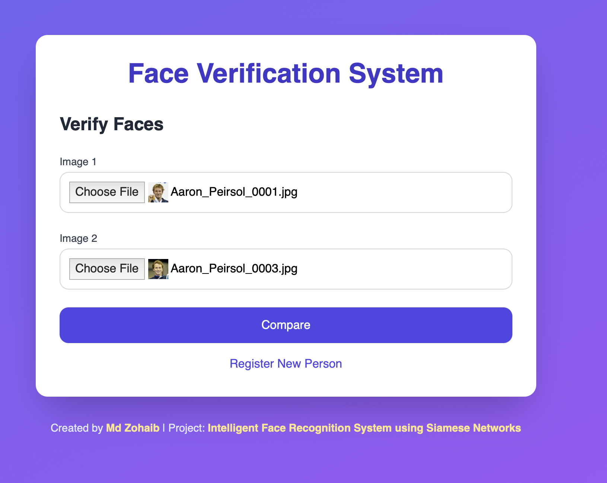

# Intelligent Face Recognition System using Siamese Networks

## Overview
This project implements a real-time identity verification system using a Siamese Neural Network trained on the Labeled Faces in the Wild (LFW) dataset. The system detects faces, compares them against known identities using similarity scores, and displays results through a Flask-based web application. Key features include:

- **Real-Time Webcam Recognition**: Detects and identifies faces in live video streams.
- **Image Pair Comparison**: Compares two uploaded images to determine if they depict the same person.
- **Identity Registration**: Allows users to register new faces with names for recognition.
- **Performance**: Achieves a training loss of 0.07 (10 epochs) and a test accuracy of 78.30%.

This project is developed as part of the ADL course (Semester 4) at SRM University by Md Zohaib.

## Project Structure
```
mini-project/
├── dataset/
│   ├── test_pairs.csv
├── static/
│   ├── haarcascade_frontalface_default.xml
│   ├── placeholder.jpg
│   ├── uploads/
├── templates/
│   ├── result.html
│   ├── upload.html
│   ├── webcam.html
├── src/
│   ├── app.py                # Flask web app
│   ├── create_test_pairs.py  # Generates test_pairs.csv
│   ├── demo.py              # Visualizes predictions
│   ├── download_dataset.py  # Downloads LFW dataset
│   ├── model.py             # Siamese Network definition
│   ├── test_dataset.py      # Tests LFWDataset
│   ├── test.py              # Evaluates model
│   ├── train.py             # Trains model
│   ├── utils.py             # Dataset utilities
├── demo_prediction.png      # Demo output
├── inference.pdf            # Inference report
├── README.md                # This file
├── requirements.txt         # Dependencies
├── roc_curve.png            # ROC curve
├── sample_predictions.png   # Test predictions
├── .gitignore               # Git ignore file
```

## Screenshots of App
Below are screenshots showcasing the user interface of the Flask web application:

- **Upload Page**: Interface for uploading two images to compare.
  
- **Result Page**: Displays comparison results with detected images.
  
- **Webcam Mode**: Real-time face recognition via webcam.
  


## Prerequisites
- **Operating System**: macOS, Linux, or Windows
- **Python**: 3.8 or higher
- **Hardware**: Webcam (for real-time recognition), GPU/MPS (optional, for faster training)
- **Kaggle Account**: For downloading the LFW dataset (configure `kagglehub`)

## Installation
1. **Clone the Repository**:
   ```bash
   git clone https://github.com/your-username/intelligent-face-recognition.git
   cd mini-project
   ```

2. **Set Up Virtual Environment**:
   ```bash
   python3 -m venv venv
   source venv/bin/activate  # On Windows: venv\Scripts\activate
   ```

3. **Install Dependencies**:
   ```bash
   pip install -r requirements.txt
   ```
   Dependencies include:
   - `torch==2.7.0`, `torchvision==0.22.0`
   - `opencv-python==4.11.0.86`
   - `flask==3.1.0`
   - `dlib==19.24.8` (for face alignment)
   - `kagglehub==0.3.12` (for dataset download)
   - See `requirements.txt` for the full list.

4. **Download LFW Dataset**:
   ```bash
   python3 src/download_dataset.py
   ```
   - Requires a Kaggle account. Set up `kagglehub`:
     ```bash
     export KAGGLE_USERNAME=your-username
     export KAGGLE_KEY=your-api-key
     ```
   - Outputs to `dataset/lfw-deepfunneled/`.
   - Alternatively, download manually from [LFW website](http://vis-www.cs.umass.edu/lfw/) and extract to `dataset/lfw-deepfunneled/`.

5. **Download Shape Predictor**:
   - Download `shape_predictor_68_face_landmarks.dat` from [Dlib’s source](http://dlib.net/files/shape_predictor_68_face_landmarks.dat.bz2).
   - Extract and place in `dataset/`:
     ```bash
     bunzip2 shape_predictor_68_face_landmarks.dat.bz2
     mv shape_predictor_68_face_landmarks.dat dataset/
     ```

6. **Download Haar Cascade**:
   - Download `haarcascade_frontalface_default.xml` from [OpenCV's GitHub](https://github.com/opencv/opencv/blob/master/data/haarcascades/haarcascade_frontalface_default.xml).
   - Place in `static/`:
     ```bash
     mv haarcascade_frontalface_default.xml static/
     ```

7. **Download Trained Model**:
   - Download `siamese_model.pth` from [Google Drive link] (replace with your link).
   - Place in `models/`:
     ```bash
     mkdir -p models
     mv siamese_model.pth models/
     ```

## Usage
### 1. Train the Model
- Run the training script to train the Siamese Network on `pairs.csv`:
  ```bash
  python3 src/train.py
  ```
- Outputs `models/siamese_model.pth` after 10 epochs (final loss: 0.07).

### 2. Test the Model
- Generate test pairs from `matchpairsDevTest.csv` and `mismatchpairsDevTest.csv`:
  ```bash
  python3 src/create_test_pairs.py
  ```
- Run the test script to evaluate (accuracy: 78.30%):
  ```bash
  python3 src/test.py
  ```
- Outputs `roc_curve.png` and `sample_predictions.png`.

### 3. Run the Flask Web App
- Start the Flask server:
  ```bash
  python3 src/app.py
  ```
- Open `http://127.0.0.1:5000` in a browser.
- Features:
  - **Upload Images**: Compare two images (`/`) for same/different person.
  - **Register Identity**: Add a new face with a name (`/register`).
  - **Webcam Mode**: Real-time face recognition (`/webcam`).

### 4. View Inference Report
- Open `inference.pdf` for a detailed project summary and results.

### 5. Demo Predictions
- Visualize predictions for sample image pairs:
  ```bash
  python3 src/demo.py
  ```
- Outputs `demo_prediction.png`.

## Dataset
- **LFW Dataset**: Contains 13,000+ images of 5,749 individuals, to be downloaded to `dataset/lfw-deepfunneled/lfw-deepfunneled/`.
- **Preprocessing**: Images are resized to 100x100 pixels, normalized, and optionally aligned using Dlib's 68-landmark predictor (`shape_predictor_68_face_landmarks.dat`).
- **Test Pairs**: Included in `dataset/test_pairs.csv` for evaluation.

## Model
- **Architecture**: Siamese Network with three convolutional layers (64, 128, 256 filters) and fully connected layers producing 256-dimensional embeddings.
- **Loss**: Contrastive loss (margin=2.0).
- **Training**: 10 epochs, batch size 32, Adam optimizer (lr=0.001).
- **Performance**: Training loss of 0.07, test accuracy of 78.30%.

## Outputs
- `roc_curve.png`: ROC curve from testing.
- `sample_predictions.png`: Sample test predictions.
- `demo_prediction.png`: Demo visualization.
- `inference.pdf`: Project report.

## Troubleshooting
- **Dependency Issues**:
  - Ensure `dlib` compiles with `cmake` and `libpng`:
    ```bash
    brew install cmake libpng  # On macOS
    ```
  - If `torch` fails on MPS, use CPU by editing `src/*.py` to set `device='cpu'`.
- **Dataset Errors**:
  - Verify `dataset/lfw-deepfunneled/` contains person folders and CSVs.
  - Run `src/create_test_pairs.py` if `test_pairs.csv` is missing.
- **Flask App**:
  - Check `static/haarcascade_frontalface_default.xml` exists.
  - Ensure permissions:
    ```bash
    chmod -R 755 static/
    ```
  - **Images Not Displaying in result.html**:
    - Run `app.py` from project root (`mini-project/`), not `src/`.
    - Ensure `static/placeholder.jpg` exists.
    - Check permissions: `chmod -R 755 static/`.
    - Verify image URLs (e.g., `http://127.0.0.1:5000/static/uploads/detected_image.jpg`).

## Contributing
- Fork the repository and submit pull requests for improvements.
- Report issues via GitHub Issues.
- Suggested enhancements:
  - Integrate MTCNN for better face detection.
  - Add video upload support.
  - Create a statistics dashboard in the Flask app.

## Acknowledgments
- **LFW Dataset**: Provided by the University of Massachusetts.
- **Libraries**: PyTorch, OpenCV, Flask, Dlib, and others listed in `requirements.txt`.
- **Author**: This project is made by Md Zohaib as a college project for SRM University.